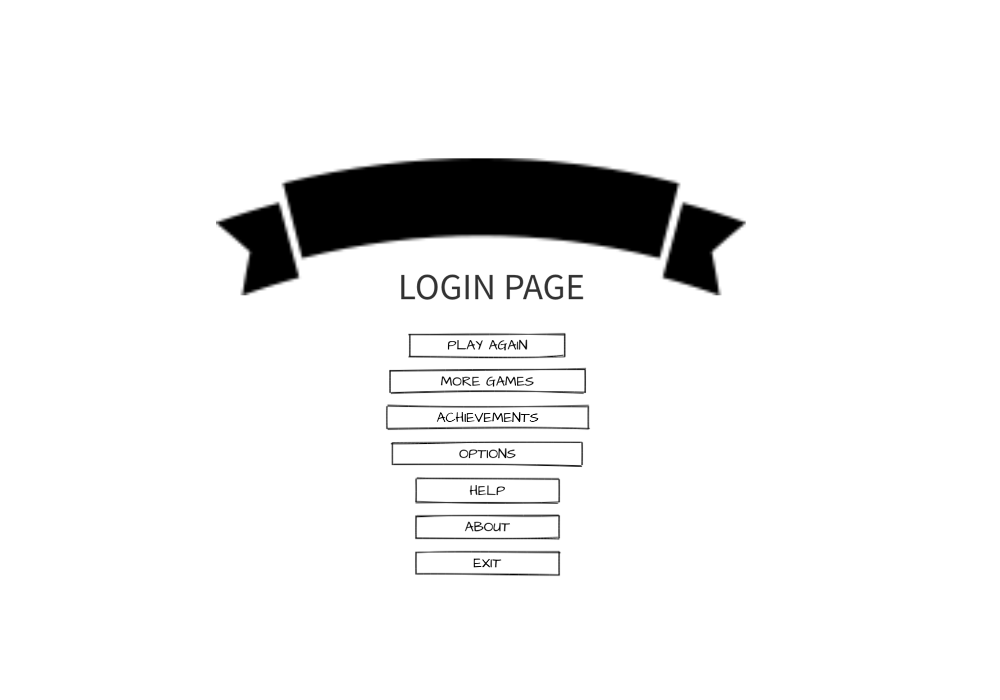
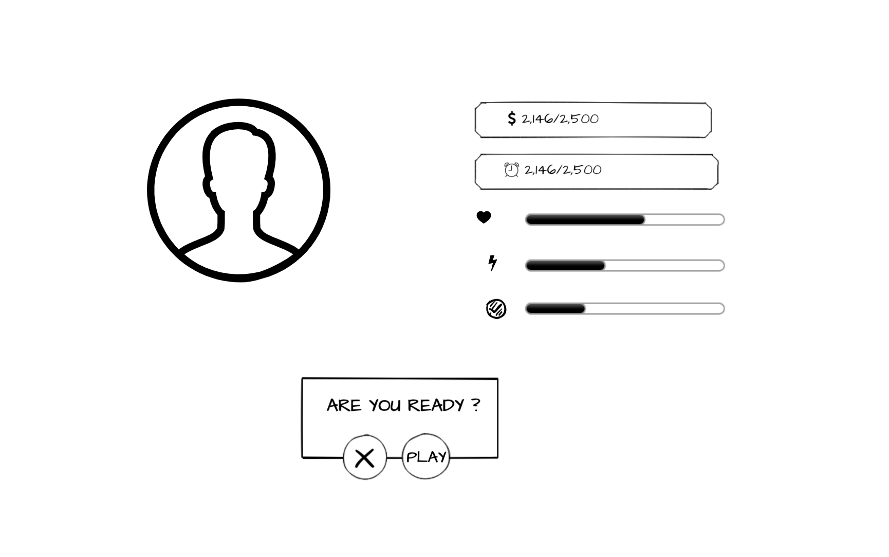
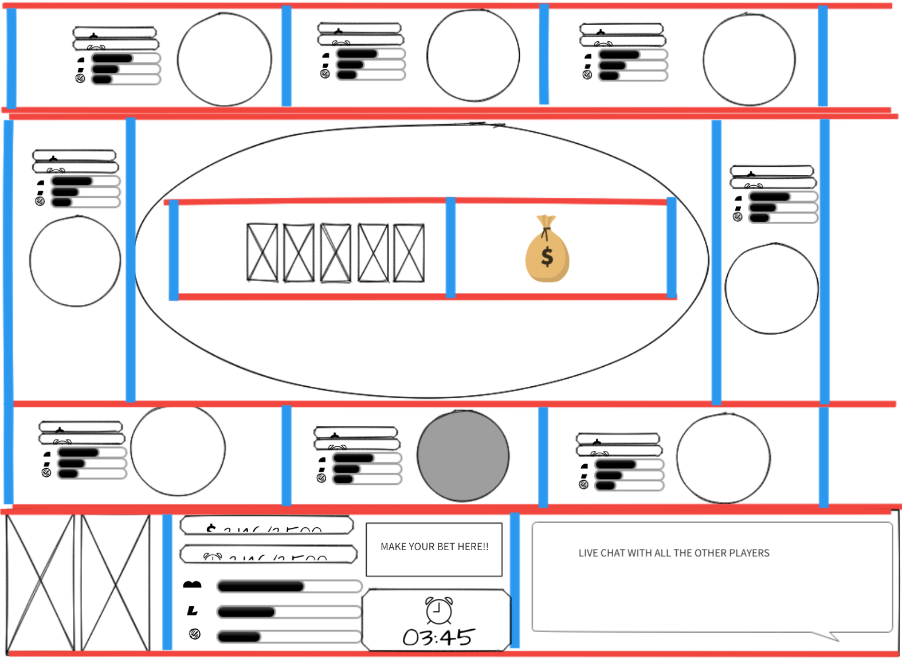

# holdem.io
## LINK TO GAME: https://holdem-io.herokuapp.com/

### Description

  holdem.io is an online multiplayer Texas Hold'em simulation built using socket.io, React.js, and Express.js. I wanted to build an app that would take advantage of reactive component's state and socket.io's immediacy. 
  The game requires two players to join before it begins, and after that any amount of players can join. Each poker room holds eight players and if more than eight players join, a new game room will be created ad infinitum. The game logic works by essentially holding a shared game state in the backened that is updated when players make an action, and then sent out to each player in a given room to rerender all the game boards. I used deckofcardsapi.com to handle the deck logic, and the pokersolver npm module to determine the winners of each hand. All of the other game logic exists mostly on the backend and within various React.js components.
  Currently the game is fully functional as long as more than one player joins. The users are stored in a MongoDB database with full password encryption. In the future I plan to add better styling and more user functionality.

#### things

- used "https://deckofcardsapi.com/" for cards and deck logic
- used "https://github.com/goldfire/pokersolver" to check hand values

## PROJECT PLAN

### PROJECT REQUIREMENTS
+ REACT.js front end
+ Express.js Server with MongoDB back end
+ Use a third party API (Deck of cards API)
+ Uses Socket.io for live gameplay feel

### USER STORIES
1. User goes to homepage
2. User enters name and clicks start game (Stretch: User logs in)
3. (Stretch: User is brought to their profile page and selects start game)
4. User enters game (***With $10000***) and game board shows
5. The poker game (Texas-hold-em) starts when 5-6 players join
6. Poker game starts and you play until you win, leave, or lose
7. Return to Title screen (Stretch: or profile page)
##### STRETCH
  + Users stored in DB (username, $$$, games, etc...)
  + A live chat box with only the current players will be in the game
  + Create game rooms with specific IDs that players can choose to join
  + Cool card animations and stuff

### WIREFRAMES

